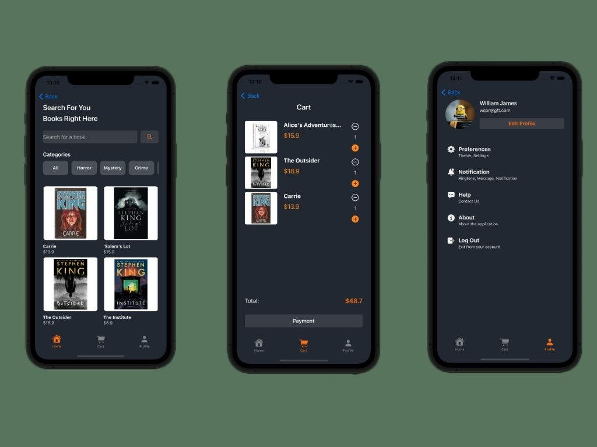

 

  <h3 align="center">Book Store App</h3>

  

    App para realizar compras de livros
  

  
Índice

      <a href="#sobre-o-projeto">Sobre o projeto</a>
      <ul>
        <li><a href="#construido-com">Construido com</a></li>
      </ul>
    </li>
    <li><a href="#contato">Contato</a></li>
  </ol>

## Sobre o projeto

### Construído com

O projeto foi construído utilizando:

- [Swift](https://www.swift.org/)

## Contato

William James - william.james.pj@gmail.com

Link do projeto: [https://github.com/william-james-pj/BookStoreApp](https://github.com/william-james-pj/BookStoreApp)
